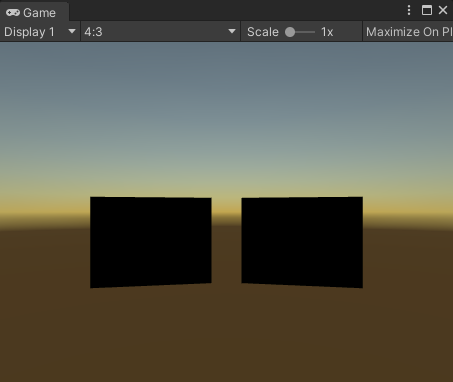

# Adding remote video

Unlike local video, the remote video track is controlled by the remote peer who will decide if and when to add the track to the connection. On the receiver side, the only thing to decide is whether or not to handle the video data received through that track.

The `VideoReceiver` Unity component is used to expose a remote video track. And similarly to the `VideoSender`, it can be added to a `MediaPlayer` to render the content of the video feed.

## Adding a video receiver

Like we did for the local video feed, we create a new game object with an `AudioReceiver` and a `VideoReceiver` component:

- In the **Hierarchy** window, select **Create** > **Create Empty**.
- Rename it to something memorable like "RemoteMediaPlayer".
- Go to the **Transform** component and
  - move the player slightly to the right side of the screen by setting an X position of `2.5`
  - slightly rotate the player toward the camera by 10 degrees about the Y axis
  - increase the scale to `(4,3,1)` to get a 4:3 aspect ratio
- In the **Inspector** window, press the **Add Component** button at the bottom of the window, and select **MixedReality-WebRTC** > **AudioReceiver**.
- Do the same to add a **MixedReality-WebRTC** > **VideoReceiver** component.

> [!IMPORTANT]
> Currently the `AudioReceiver` component is optional because audio is directly played out by the implementation without any user control (See issue [#92](https://github.com/microsoft/MixedReality-WebRTC/issues/92)). This will be fixed eventually, at which point the `AudioReceiver` will become mandatory for remote audio playback. Therefore this turorial assumes best practices and adds the component already.

Like for the audio and video senders, the receiver components need to be associated with the peer connection through a transceiver media line. Select the `PeerConnection` component again, and assign the new receivers to the audio and video media lines.

## Adding a remote media player

This is again similar to the media sender: the audio and video receivers only expose some frame queue which gets populated using the media frames coming from the remote peer, but the component does not do any rendering/output by themselves. Instead we can use again a [`MediaPlayer`](xref:Microsoft.MixedReality.WebRTC.Unity.MediaPlayer) to render those media frames.

- The [`MediaPlayer`](xref:Microsoft.MixedReality.WebRTC.Unity.MediaPlayer) component exposes the video frames as 3 animated [`Texture2D`](https://docs.unity3d.com/ScriptReference/Texture2D.html), one for each of the YUV components, which need a mesh to be applied to. Add a **Mesh Filter** component, a **Mesh Renderer** component, and a **Media Player** component.
  - In the **Mesh Filter** component, set the **Mesh** property to the built-in Unity **Quad** mesh, which is the most simple mesh we can use (2 triangles) to display a texture. But any other mesh would do.
  - In the **Mesh Renderer** component, expand the **Materials** array and set the first material **Element 0** to the  `YUVFeedMaterial` material located in the `Assets/Microsoft.MixedReality.WebRTC.Unity/Materials` folder. This material uses a custom shader to convert the 3 textures of the [`MediaPlayer`](xref:Microsoft.MixedReality.WebRTC.Unity.MediaPlayer) component (YUV, one per video component) into some RGB value for rendering.
  - In the **Media Player** component, set the **Video Source** property to the video receiver component previously created.
- Currently due to issue [#92](https://github.com/microsoft/MixedReality-WebRTC/issues/92) as mentioned above the audio frames are exposed but they are also automatically output to the local speakers. Therefore we simply assign the **Audio Source** property to the audio receiver component previously created, for the sake of completeness. Audio handling will need further setup once this issue is fixed.

The **Inspector** window should now look like this:

And we should be able to see in the **Scene** window our two black squares representing the local and remote media players:

