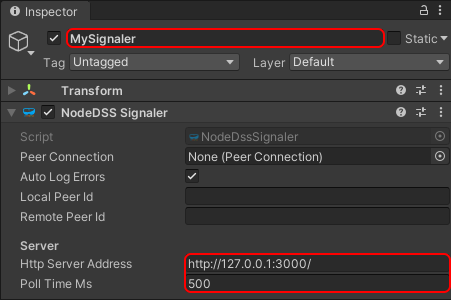

# Creating a signaler

The WebRTC standard specifies how a peer-to-peer connection can be established using the [Session Description Protocol (SDP)](https://en.wikipedia.org/wiki/Session_Description_Protocol), but does not enforce a particular signaling solution to discover and select a remote peer, and to send to and receive from it the SDP messages necessary to establish that connection.

MixedReality-WebRTC offers a built-in solution in the form of the [`NodeDssSignaler`](xref:Microsoft.MixedReality.WebRTC.Unity.NodeDssSignaler) component, but also allows any other custom implementation to be used. For this tutorial, we will use the [`NodeDssSignaler`](xref:Microsoft.MixedReality.WebRTC.Unity.NodeDssSignaler) component for simplicity.

> [!Caution]
> [`NodeDssSignaler`](xref:Microsoft.MixedReality.WebRTC.Unity.NodeDssSignaler) is very simple and useful for getting started quickly and debugging, but it is worth noting that **this is not a production-quality solution and should not be used in production**. In particular, this component offers **no security whatsoever**. All communications are taking place in clear text over HTTP, and with **no authentication**, as all it requires to connect with a remote peer is to know its identifier. Do not be fooled by the fact that WebRTC supports encryption, as it would be very easy for an attacker to bypass it by compromising the signaler. Remember that any security solution is no better than its weakest link, and [`NodeDssSignaler`](xref:Microsoft.MixedReality.WebRTC.Unity.NodeDssSignaler) is that link. It must be replaced with a secure solution when moving to production.

The [`NodeDssSignaler`](xref:Microsoft.MixedReality.WebRTC.Unity.NodeDssSignaler) component uses a [Node.js](https://nodejs.org/) server with a simple polling model where both peers are constantly checking if a message is available. The server implementation is called [`node-dss`](https://github.com/bengreenier/node-dss) and is freely available on GitHub.

## Install and run `node-dss`

The `node-dss` repository has [instructions on how to install and run the server](https://github.com/bengreenier/node-dss/blob/master/README.md), which essentially boil down to installing Node.js, downloading the code, and running:

```cmd
set DEBUG=dss*
npm install
npm start
```

This opens a console window which will output all requests received from all peers. Leave that console window open and the `node-dss` server running for the following, and go back to the Unity editor.

## Creating a [`NodeDssSignaler`](xref:Microsoft.MixedReality.WebRTC.Unity.NodeDssSignaler)

The [`NodeDssSignaler`](xref:Microsoft.MixedReality.WebRTC.Unity.NodeDssSignaler) component can be added to the existing [`GameObject`](https://docs.unity3d.com/ScriptReference/GameObject.html), or to a new one. There is no fundamental difference, and this is mostly a matter of taste. For this tutorial we will create a separate game object to separate it from the peer connection in the Hierarchy window.

Create a new [`GameObject`](https://docs.unity3d.com/ScriptReference/GameObject.html) with a [`NodeDssSignaler`](xref:Microsoft.MixedReality.WebRTC.Unity.NodeDssSignaler) component:

- In [the **Hierarchy** window](https://docs.unity3d.com/Manual/Hierarchy.html), select **Create** > **Create empty** to add a new [`GameObject`](https://docs.unity3d.com/ScriptReference/GameObject.html) to the scene.
- In [the **Inspector** window](https://docs.unity3d.com/Manual/UsingTheInspector.html), select **Add Component** > **MixedReality-WebRTC** > **NodeDssSignaler** to add a [`NodeDssSignaler`](xref:Microsoft.MixedReality.WebRTC.Unity.NodeDssSignaler) component to that new object.
- Optionally rename the game object to something easy to remember like "MySignaler" to easily find it in the Hierarchy window.



By default the [`NodeDssSignaler`](xref:Microsoft.MixedReality.WebRTC.Unity.NodeDssSignaler) component is configured to connect to a `node-dss` server running locally on the developper machine at `http://127.0.0.1:3000/` and poll the server every 500 milliseconds to query for available messages. If using another machine, the HTTP address must be changed.

## Connecting the signaler

Now that a signaling solution is available, the last step is to assign the [`Signaler.PeerConnection`](xref:Microsoft.MixedReality.WebRTC.Unity.Signaler.PeerConnection) property of the peer connection component created earlier:

1. In the **Hierarchy** window, make sure the game object with the peer connection component is selected, then in the **Inspector** window find the `Peer Connection` property and click on the circle to its right to bring the asset selection window
2. Select the **Scene** tab of that window
3. Select the game object with the [`PeerConnection`](xref:Microsoft.MixedReality.WebRTC.Unity.PeerConnection) component on it.
4. The name of the [`GameObject`](https://docs.unity3d.com/ScriptReference/GameObject.html) containing the component now appears next to the `Peer Connection` property, followed by "`(PeerConnection)`" to indicate the actual value is the component of that game object.

The signaler object should now appear in the **Inspector** window of the peer connection game object.


At that point the peer connection is fully configured and ready to be used. However audio and video tracks are not added automatically, so there is little use for that peer connection. Next we will look at connecting a local webcam and microphone to provide some video and audio track to send through to the peer connection.

----

Next : [Adding local video](helloworld-unity-localvideo.md)
