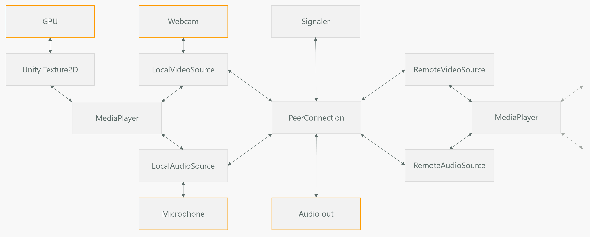

# Unity integration overview

The Unity integration offers a simple way to add real-time communication to an existing Unity application. MixedReality-WebRTC provides a collection of Unity componenents ([`MonoBehaviour`](https://docs.unity3d.com/ScriptReference/MonoBehaviour.html)-derived classes) which encapsulate objects from the [underlying C# library](../cs/cs.md), and allow in-editor configuration as well as establishing a connection to a remote peer both in standalone and in [Play mode](https://docs.unity3d.com/Manual/GameView.html).

- The [`PeerConnection`](xref:Microsoft.MixedReality.WebRTC.Unity.PeerConnection) component is the entry point for configuring and establishing a peer-to-peer connection.
- The peer connection component makes use of a [`Signaler`](xref:Microsoft.MixedReality.WebRTC.Unity.Signaler) to handle the [SDP](https://en.wikipedia.org/wiki/Session_Description_Protocol) messages dispatching until the direct peer-to-peer connection can be established.
- Audio and video tracks from a local audio (microphone) and video (webcam) capture device are handled by the [`MicrophoneSource`](xref:Microsoft.MixedReality.WebRTC.Unity.MicrophoneSource) and [`WebcamSource`](xref:Microsoft.MixedReality.WebRTC.Unity.WebcamSource) components, respectively.
- For remote tracks, similarly the [`AudioReceiver`](xref:Microsoft.MixedReality.WebRTC.Unity.AudioReceiver) and [`VideoReceiver`](xref:Microsoft.MixedReality.WebRTC.Unity.VideoReceiver) respectively handle configuring a remote audio and video track streamed from the remote peer.
- Rendering of both local and remote media tracks is handled by the [`MediaPlayer`](xref:Microsoft.MixedReality.WebRTC.Unity.MediaPlayer) component, which connects to a video source and renders it using a custom shader into a Unity Texture2D object which is later applied on a mesh to be rendered in the scene.

> [!Warning]
> Currently the remote audio stream is sent directly to the local audio out device (see issue [#92](https://github.com/microsoft/MixedReality-WebRTC/issues/92)), without any interaction with the [`MediaPlayer`](xref:Microsoft.MixedReality.WebRTC.Unity.MediaPlayer) component, while the local audio stream is never played out locally, only streamed to the remote peer.
